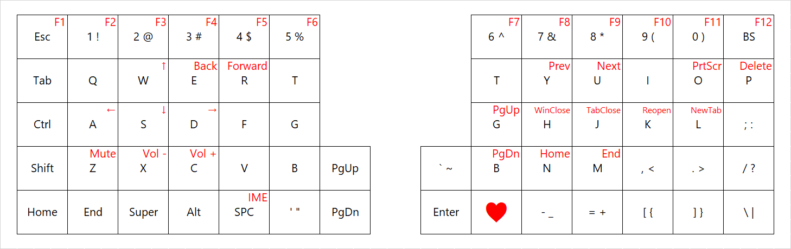

# Helix: modified



## Setup

### Windows 10

The easiest way I've found is using WSL.
The official QMK document states the recommended way is using MSYS2, but at least building is working.
For flashing, use QMK Toolbox on Windows.
In the past I've experienced it hanged while flashing, which led two Pro Micro boards to be bricked for ever, and me to be very sad,
but in most cases it appears to work.
Run `sudo util/install_dependencies.sh` on Bash on Windows, which was suggested for Linux in the docs.

## Build

```sh
make
```
